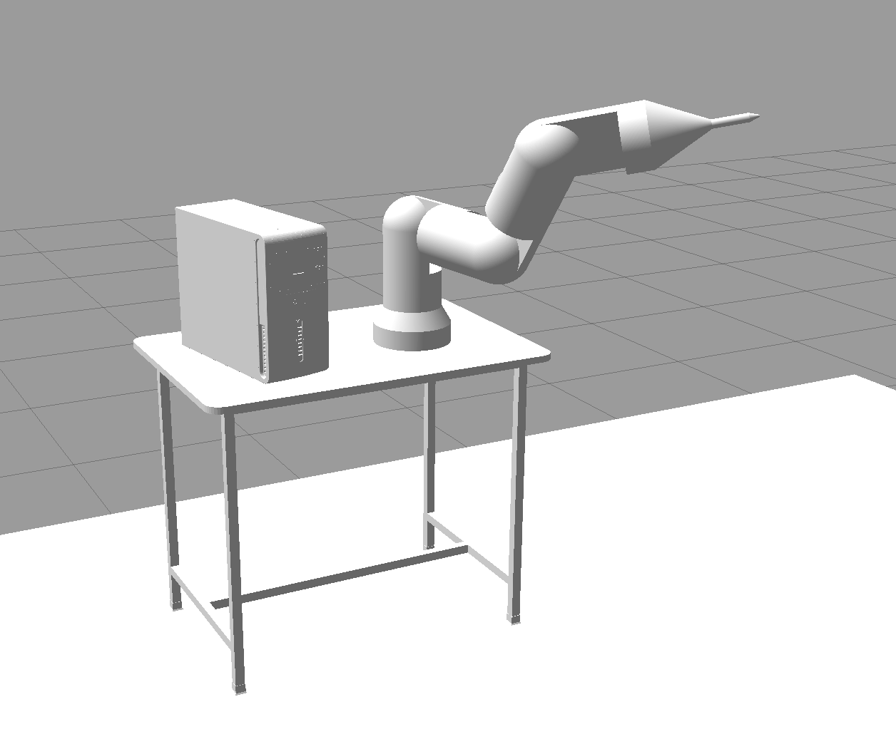

# examplerobot_ros
This is a collection of ROS packages for `examplerobot`, a 6DOF manipulator from URDF.



The robot is a 6DOF articulated robot arm with a spherical wrist. 

## Denavit-Hartenberg (DH) Convention
The frame assigments for each link follow the modified Denavit and Hartenberg convention, and the parameters can be seen in `examplerobot_description/config/dh_parameters.txt`. Classical (Spong) DH is preferred, but is not currently used because of URDF integration issue (please correct me if I am wrong).    

## Packages
- `examplerobot_description`: physical description of the robot (geometry, mass, etc.) in URDF with xacro
- `examplerobot_moveit_config`: ROS moveit configuration generated by `setup_assistant` 
- `examplerobot_interface`: ROS moveit C++ interface examples
- `examplerobot_gazebo`: Gazebo simulator configuration (world, physics, etc.)

## Environment

The branch `noetic` has been tested on Ubuntu 20.04 + ROS Noetic (desktop-full). The following packages are required. This may not be the minimal list.

```
ros-noetic-rviz ros-noetic-joint-state-publisher-gui ros-noetic-gazebo-ros ros-noetic-gazebo-ros-pkgs ros-noetic-gazebo-ros-control ros-noetic-rqt-reconfigure ros-noetic-rqt-publisher ros-noetic-controller-manager ros-noetic-ros-control ros-noetic-ros-controllers ros-noetic-moveit ros-noetic-moveit ros-noetic-moveit-core ros-noetic-rviz-visual-tools ros-noetic-moveit-visual-tools 
```

Put this package in a `catkin build` workspace. `catkin_make` might work too. The variable `CATKIN_WS_PATH` is used for convenience.

```
export CATKIN_WS_PATH="<YOUR CATKIN WORKSPACE>"
cd $CATKIN_WS_PATH/src
git clone https://github.com/thillRobot/examplerobot_ros.git
```

Test that is compiles. This is not neccesary if you are going to use docker. (see Usage)

```
cd $CATKIN_WS_PATH
catkin build
```

Source the setup files after building.

```
source devel/setup.bash
source /opt/ros/noetic/setup.bash
```

Also source the Gazebo setup files. 
```
export GAZEBO_RESOURCE_PATH="$GAZEBO_RESOURCE_PATH$CATKIN_WS_PATH/src/examplerobot_ros/examplerobot_gazebo/worlds:" && \
             source /usr/share/gazebo/setup.sh
```

Alternatively, use docker to avoid the environment setup (see instructions below).


## Usage

There are launch files in `examplerobot_interface` and `examplerobot_gazebo`. 

### C++ Interface Example:
```
roslaunch examplerobot_interface examplerobot_interface.launch
```

[](https://www.youtube.com/watch?v=2-xvE710MgQ)

Click the screenshot to watch a demonstration on Youtube.

### Gazebo Simulator Example:
```
roslaunch examplerobot_gazebo gazebo.launch x:=1 y:=1 z:=1
```


### Docker

Alternatively, you could stand up the full app (OS + environment) with docker.

Build the container from the Dockerfile. This uses the standard image `ros:noetic-robot-focal`.
```
cd docker
docker build -t examplerobot .
```

For now, this requires disabling xauth access control... I would like to fix this. 
```
xhost +
```

Start the robot with a script.
```
./examplerobot_interface.bash
```

or 

```
./examplerobot_gazebo.bash
```

### docker-compose

The pro way to do it is with docker-compose. Yes, we really need another layer.

For now, this requires disabling xauth access control... I would like to fix this. 
```
xhost +
```

Use this instead
```
xhost local:root
```

Start the application, use the build flag if neccesary. The container will look for the source code at `$CATKIN_WS_PATH/src` using a shared volume.

```
cd docker 
docker-compose up 
```

This will run the the entrypoint script I think. Close when you are done.

Now run a service named in the `docker-compose.yaml`

```
docker-compose run examplerobot-ompl
```

This will run the command associated with the service `examplerobot`

When you are done, shut down and clean up.

```
docker-compose down --remove-orphans
```

### Planning Pipelines 

The example code described above uses the default Moveit planner pipeline "ompl". 

I am currently experimenting with the build from source version of Moveit and the experimental features from Jeroen Maeyer discussed [here](https://moveit.ros.org/moveit/2020/09/10/ompl-constrained-planning-gsoc.html)


Dr. Coleman, Dr. Moll, and Dr. Zelenak discuss different options [here](https://picknik.ai/cartesian%20planners/moveit/motion%20planning/2021/01/07/guide-to-cartesian-planners-in-moveit.html) and reccomend "Moveit Servo" (see moveit/moveit_ros/moveit_servo)